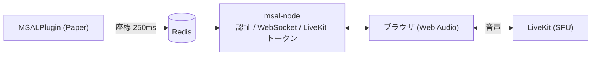

# Minecraft Spatial Audio Link

Minecraft (Paper) 用の独自ボイスチャットシステム。ゲーム内の座標・向き・ワールドをブラウザの音声に同期し、近接チャット（3D 立体音響）と最大 2km のラジオ（ノイズ付き・ワールド越境）を実現します。



| ディレクトリ | 内容 |
| :--- | :--- |
| [`src/msal-plugin`](src/msal-plugin) | Paper プラグイン（座標収集・`/vc`・`/radio`）。Java 21 / Maven |
| [`src/msal-node`](src/msal-node) | バックエンド（Express + WebSocket + Web UI）。Node.js 22.13+ |
| [`src/msal-livekit`](src/msal-livekit) | LiveKit サーバー設定のサンプル |
| [`仕様`](仕様) | 要件定義・仕様書・詳細設計（実装状況は [仕様書 §8](仕様/基本/仕様書.md)） |

## 仕組み（要約）

1. プレイヤーがゲーム内で `/vc join` → プラグインがバックエンドに **6 桁のワンタイムコード**（5 分有効）を発行させ、ログイン URL を表示。
2. ブラウザで MCID とコードを入力してログイン → ダッシュボードで「接続」。
3. プラグインが 250ms ごとに全プレイヤーの状態を Redis へ書き込む（TTL 5 秒）。
4. バックエンドが「誰の声を聞くべきか」を算出して WebSocket で配信。ブラウザはその相手の音声だけを LiveKit から購読し、Web Audio で定位・減衰・加工して再生。

| モード | 条件 | 音 |
| :--- | :--- | :--- |
| 近接 | 同一ワールド・購読 100m / 可聴 50m | HRTF 定位、距離で減衰・高域カット |
| ラジオ | `/radio <ch>` が同じ（別ワールドは d=2000m 固定） | バンドパス、500m 超でノイズ混入（2km で 90%） |

詳細は [`仕様`](仕様) を参照。

## セットアップ

### 前提
Redis、LiveKit サーバー、Node.js 22.13+、Java 21 / Maven、Paper 1.20.x。

### 1. LiveKit
`src/msal-livekit/livekit.yaml.example` をコピーして `livekit.yaml` を作成し、`node_ip` とキーを設定して LiveKit を起動。
UDP 7882（と TCP 7881）はクライアントから直接届く必要があります。Cloudflare Tunnel では UDP を通せないため、**ルーターのポート開放（二重ルーターなら両段）または TURN** が必要です。

### 2. バックエンド (msal-node)
```bash
cd src/msal-node
cp .env.example .env     # SESSION_SECRET / PLUGIN_API_KEY / LIVEKIT_* / REDIS_URL を設定
npm ci
npm start                # 既定ポート 8010
```
- `SESSION_SECRET` と `PLUGIN_API_KEY` は 16 文字以上のランダム値（`openssl rand -hex 32`）。未設定・弱い値では起動しません。
- Cloudflare Tunnel など**リバースプロキシ配下**では `TRUST_PROXY=1`（既定）のままにしてください（secure cookie と IP 判定に必要）。
- プレイヤーが開く公開ホスト名には、Cloudflare Access の管理者限定ポリシーを**掛けない**でください（掛けると一般プレイヤーがログインできません）。`/api/vc/token/generate/` は共有シークレットで保護されていますが、可能なら内部 IP からのみ到達できるようにしてください。

主な環境変数は [`.env.example`](src/msal-node/.env.example) を参照。

### 3. プラグイン
```bash
cd src/msal-plugin
mvn package              # target/MSALPlugin-1.0.0.jar
```
jar を Paper の `plugins/` に置いて一度起動し、生成された `plugins/MSALPlugin/config.yml` を編集（`redis.*`, `backend.base-url`, `backend.login-url`, **`backend.api-key`**＝`PLUGIN_API_KEY` と同じ値）。`api-key` が空だとプラグインは無効化されます。

| コマンド | 権限（既定） | 説明 |
| :--- | :--- | :--- |
| `/vc join` | `msal.use`（全員） | ログインコードを発行して URL を表示 |
| `/vc broadcast <message>` | `msal.broadcast`（op） | 全体にタイトル表示（音声放送は未実装） |
| `/radio <ch>` | `msal.use`（全員） | 無線チャンネル切替。`0` で解除 |

## 開発

```bash
cd src/msal-node
npm test                 # ユニットテスト + 統合テスト（Redis が無ければ統合テストはスキップ）
```
統合テストは `redis://127.0.0.1:6379/15`（テスト専用 DB。**`FLUSHDB` するので本番 DB を指定しない**）を使います。`MSAL_TEST_REDIS_URL` で変更可能。

## セキュリティ上の注意

- 音声の購読制御（誰の声を受け取るか）は現状クライアント側で行っています。改造したクライアントは他人の音声を購読できるため、厳密に防ぎたい場合は LiveKit のサーバー API（`updateSubscriptions`）での強制が必要です（未実装）。
- 管理者パネル・RBAC は未実装です。

## ライセンス
[LICENSE](LICENSE) を参照。
