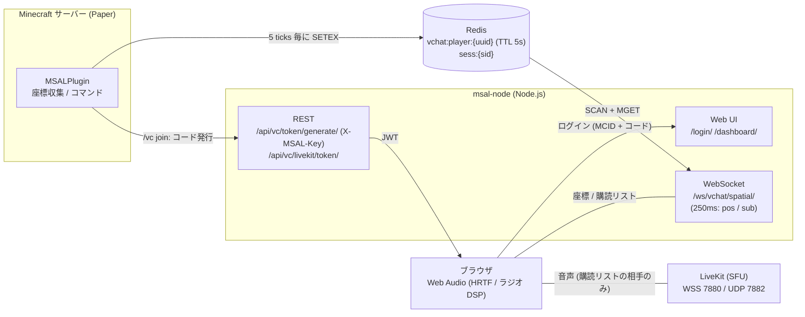

**仕様書**V4
# Minecraft Spatial Audio Link 仕様書 (Spec)

## 1. システム品質目標 (SLA/性能要件)
リアルタイム性を担保するため、以下の遅延目標を定義する。
* **音声遅延 (End-to-End):** クライアント—SFU間 100ms 未満、理想値 50ms。
* **制御信号遅延:** Plugin → Redis → msal-node → Client 間の座標同期を 200ms 以内に完了。
* **ジッター耐性:** SFU側でのバッファリングを最小限（20ms程度）にし、定位の「飛び」を抑制。

---

## 2. 音声通信モードと優先順位ロジック

### 2.1 優先順位（高い順）
1.  **管理者全体放送:** 常に最優先。他を減衰（ダッキング）させる。
2.  **ラジオ機能:** ワールド越境対応。同一チャンネルのみ購読。
3.  **近接チャット:** 同一ワールド、100m 以内。

### 2.2 ワールド越境と複数接続の挙動
* **別ワールド時のラジオ:** 距離 $d = 2000$ 固定として処理。
* **複数チャンネル所属:** チャンネルごとに独立した `GainNode` を生成し、クライアント側でミックス。ただし、帯域節約のため「発話者がいるチャンネル」のみを動的に購読（Subscribe）する。

---

## 3. 音響信号処理の詳細 (DSP)

### 3.1 HRTF 定位の選定
* **エンジン:** Web Audio API 標準の `PannerNode` (`panningModel: 'HRTF'`) を採用。
* **補完:** 前後左右の定位を明確にするため、距離に応じた `BiquadFilterNode` による高域遮断を併用し、「こもり」による距離感のヒントを脳に与える。

### 3.2 ダッキング (Ducking) 仕様
* **減衰量:** デフォルト 30%（-10dB 相当）。**実装上は「放送中に他の音声が残る割合 = 30%（≈ -10.5dB）」と解釈**している。
* **調整:** Sawamura 専用 UI（msal-node 配下） から 0% 〜 100% の範囲で動的に変更可能とする。
* **競合:** 2 つ以上の放送が重なった場合、単純な加算ミックス（音割れ防止に `DynamicsCompressor` を最終段に配置）を行う。

### 3.3 二重 VAD と自動キャリブレーション
* **仕様:** クライアント側 VAD は、接続時に 3 秒間の「静寂環境測定」を行い、背景ノイズ + 5dB を閾値として自動設定する。
* **サーバー側:** SFU 側でパケットが途切れた際、急激な無音化による違和感を防ぐため、数ミリ秒のフェードアウト処理を行う。

---

## 4. 権限管理とセキュリティ (RBAC)

権限体系を以下の 3 レベルで定義する。Super Admin は UUID（環境変数 `SUPER_ADMIN_UUIDS`）で固定し、Moderator は LuckPerms 等のパーミッションノードをプラグイン側で評価する（バックエンドは Moderator を区別しない）。

| ロール | 権限範囲 | 備考 |
| :--- | :--- | :--- |
| **Super Admin (Sawamura)** | 全機能アクセス、全チャンネル強制傍受、システム設定変更（ダッキング量・強制放送）。 | UUID で固定（`SUPER_ADMIN_UUIDS`）。Web の管理パネルは Super のみ。 |
| **Moderator (Admin)** | `/vc broadcast` 実行権限（`msal.broadcast`）、担当チャンネルのミュート権限（`msal.mute.<ch>` / `msal.mute.*`）。 | LuckPerms の権限グループにこれらのノードを付与して連動。 |
| **General User** | 近接チャット、指定されたラジオチャンネルの使用。 | 一般プレイヤー。 |

---

## 5. インフラと可用性 (Availability)

### 5.1 Redis の高可用性
* **構成:** 単一障害点 (SPOF) 回避のため、Proxmox 上の別 VM にて **Redis Sentinel** 構成（1 Master, 1 Replica）を検討。
* **永続化:** 座標データは `noeviction` 設定とし、再起動時は Plugin からの再送により復旧させる。

### 5.2 ネットワーク構成
* **二重ルーター:** Cloudflare Tunnel を経由し、外部公開用エンドポイント（HTTPS/WSS）を一本化。
* **SFU:** UDP ポートはルーター側で固定ポートマッピングを行い、STUN/TURN サーバーによる NAT 越えをサポート。

---

## 6. テスト・検証戦略

実装後のリスク回避のため、以下のシナリオテストを実施する。

1.  **VAD 耐性テスト:** 扇風機の音やキーボード打鍵音がある環境で、声だけが正しくゲートを通るか確認。
2.  **空間定位テスト:** 4 人のプレイヤーを東西南北に配置し、目をつぶった状態で発話者の位置を特定できるか（HRTF の正確性）。
3.  **負荷テスト:** 同一ラジオチャンネルに 20 人が同時に発話した場合の、ブラウザ側 CPU 使用率と SFU のパケット転送遅延の測定。
4.  **越境テスト:** Overworld と Nether に分かれた際、期待通り「ノイズ混じりの無線」が成立するか。

---

## 7. 最終構成イメージ図

経路の外部公開は Cloudflare Tunnel（HTTPS/WSS）。LiveKit の UDP は Tunnel を通らないため、ルーターのポート開放または TURN が必要（§5.2）。

---

## 8. 実装状況（ロードマップ）

| 機能 | 状態 | 備考 |
| :--- | :--- | :--- |
| Plugin → Redis 座標送信（250ms / TTL 5s / ワールド・チャンネル付き） | ✅ 実装済み | メインスレッドで収集し、Redis 書き込みのみ非同期 |
| ワンタイムコード認証（有効期限・失敗制限・共有シークレット） | ✅ 実装済み | |
| 近接チャット（同一ワールド、購読 100m / 可聴 50m、HRTF、高域カット） | ✅ 実装済み | |
| ラジオ（同一チャンネル、別ワールド d=2000、バンドパス、ノイズ） | ✅ 実装済み | |
| 動的購読（Selective Subscription） | ✅ 実装済み | クライアント側で制御（LiveKit `autoSubscribe:false`）。サーバー側での強制は未実装 |
| 最終段 DynamicsCompressor | ✅ 実装済み | |
| 管理者全体放送 + ダッキング（§2.1, §3.2） | ✅ 実装済み | `/vc broadcast <msg>` / `stop`、Super Admin は管理パネルから。放送者の声は距離・方向・ノイズなしで中央に定位し、放送以外の音量を絞る。複数放送は加算ミックス |
| ダッキング量の動的変更（0〜100%） | ✅ 実装済み | 管理パネルのスライダー。Redis に永続化 |
| クライアント VAD + 3 秒自動キャリブレーション（§3.3） | ✅ 実装済み | 背景ノイズ（上位 10% 除外）+ 5dB（-60〜-20dB にクランプ）、語尾 300ms ホールド。閉じている間はトラックを無効化（Opus DTX によりパケットが止まる）。ミリ秒単位のフェードアウトは SFU 側設定の領域で未対応 |
| RBAC（Super Admin / Moderator / General）、LuckPerms 連動（§4） | ✅ 実装済み | Super = UUID 固定、Moderator = パーミッションノード（`msal.broadcast`, `msal.mute.*`）、General = それ以外 |
| 担当チャンネルのミュート | ✅ 実装済み | `/vc mute\|unmute <ch>`。ミュート中チャンネルの発話者はラジオでは聞こえない（近接では聞こえる） |
| Sawamura 専用管理パネル（全チャンネル傍受・強制放送） | ✅ 実装済み | ダッシュボード内（Super のみ表示、API も Super 限定）。ゲーム内にいなくても放送・傍受に参加可能 |
| 音源 API（動画の音など座標付きスピーカー） | ✅ 実装済み | [音源API](../詳細設計/音源API.md)。push（PCM を HTTP で流し込む）/ URL（msal-node の ffmpeg が取得）。VideoMap 連携パッチは `integrations/mcvideo` |
| スニーク / 水中 / 地下の演出（プラグイン仕様 §4） | ✅ 実装済み | スニーク = 音量 60%、水中 = ローパス 700Hz + 7Hz のボコボコ変調、地下（y ≤ 0）= 近接のみ残響 |
| Redis Sentinel 構成（§5.1） | ⬜ 未実装 | 検討段階。node-redis v4 は Sentinel 非対応のため、採用時は v5 への更新が前提 |
| 購読のサーバー側強制 | ⬜ 未実装 | 現状は購読リストに従う「正直なクライアント」前提。LiveKit サーバー API（`updateSubscriptions`）での強制が必要 |
