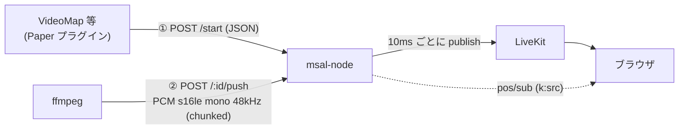

## 概要

動画の音など「サーバー側で作った音」を、ボイスチャットの空間音響に乗せるための API。
**音源（Audio Source）** は座標を持つ仮想スピーカーで、LiveKit に `audio:<id>` という参加者として入り、音声を publish する。
プレイヤーは音源の `range` 以内に近づくと聞こえ（HRTF で方向も分かる）、離れると購読が外れて聞こえなくなる。



## 音声の入れ方（2 通り）

| 方式 | 使いどころ | 流れ |
| :--- | :--- | :--- |
| **push** | ローカルファイル、OBS 配信を受けているときなど、msal-node から取れない音 | `start`（`source` なし）→ 返ってきた `pushPath` に ffmpeg 等が PCM を HTTP チャンク POST |
| **URL** | http / https / rtmp / rtmps / rtsp / srt で取れる音 | `start` に `source` を渡すと msal-node の ffmpeg が取りに行く |

push の PCM は **raw s16le / モノラル / 48000Hz**。ffmpeg の出力指定例:

```
-vn -ac 1 -ar 48000 -f s16le -headers "X-MSAL-Key: <PLUGIN_API_KEY>\r\n" -method POST -chunked_post 1 http://<msal-node>/api/vc/plugin/audio/<id>/push
```
動画の映像出力と同じ ffmpeg に出力を 1 つ足せば、映像と音声が同じ入力から同時に出る（`-re` も共有される）。

## エンドポイント

すべて `X-MSAL-Key`（共有シークレット = `PLUGIN_API_KEY`）が必須。変更系は `Content-Type: application/json`。

| エンドポイント | 説明 |
| :--- | :--- |
| `POST /api/vc/plugin/audio/start` | 音源を作る（同じ `id` は作り直し）。ボディ: `id`（`[A-Za-z0-9_-]{1,64}`）, `world`, `x`, `y`, `z`, `range`（1〜128, 既定 32）, `volume`（0〜1, 既定 1）, 任意で `source`（URL 方式）, `loop`, `live`, `reconnect`。応答: `{ok, audio, pushPath?}` |
| `POST /api/vc/plugin/audio/:id/push` | push 方式の PCM 受信（長時間の 1 本の POST。バックプレッシャあり）。同じ `id` への新しい接続が来ると古い接続は切られる |
| `POST /api/vc/plugin/audio/update` | `id` と、変更したい `world` / `x,y,z` / `range` / `volume` |
| `POST /api/vc/plugin/audio/stop` | `{id}` で 1 つ、`{all:true}` で全部 |
| `GET /api/vc/plugin/audio/list` | 一覧（URL 中の認証情報は伏せる） |
| `POST /api/vc/admin/audio/stop` | Super Admin のセッションで 1 つ停止（管理パネルの「停止」ボタン） |

エラー: 400（入力不正）/ 401（シークレット）/ 404（`id` なし）/ 409（作成中に停止された）/ 429（`AUDIO_MAX_SOURCES` 超過）/ 502（LiveKit に入れない）。

## 寿命と後片付け

- **push**: データが途切れてから `AUDIO_IDLE_TIMEOUT_SEC`（既定 30 秒）で自動撤去。呼び出し側が `stop` し忘れても残らない。
- **URL**: ffmpeg が終了したら撤去（`reconnect:true` なら 2 秒後に取り直す）。壊れた URL もここで撤去される。
- LiveKit から切断されたら撤去。msal-node の終了時は全音源を停止。
- 同時に作れる数は `AUDIO_MAX_SOURCES`（既定 8）。音源 1 つにつき LiveKit の参加者を 1 人使う。

## 聞こえ方（ブラウザ側）

- サーバーは 250ms ごとに「同一ワールドで `range` 以内の音源」を `k:"src"` として各クライアントに送る（`p`, `dist`, `range`, `vol` 付き）。ワールドを跨いでは聞こえない。
- クライアントは HRTF の PannerNode で定位し、距離で線形に減衰（`range` で無音）。ダッキング（放送中）の対象。スニーク・水中などの演出は掛からない。
- 購読も `range` に連動する。範囲外の音源の音声は受信しない。

## 制限・注意

- 音は LiveKit 経由なので映像より遅れる（目安 0.3〜0.5 秒）。VideoMap 連携は映像側を遅らせて合わせる（`video-delay-ms`）。
- モノラルのみ（定位は座標で行う）。
- 購読の制御はクライアント側（既存の購読リストと同じ前提）。
- **HTTP クライアントは HTTP/1.1 を使うこと。** Java 標準の `HttpClient` は既定で cleartext の h2c アップグレードを試みるが、msal-node は WebSocket 以外の `Upgrade` を `426` で断る（`HttpClient.newBuilder().version(HttpClient.Version.HTTP_1_1)` で回避）。
- 音声の取得 URL は SSRF に注意。API は共有シークレットで保護されており、ffmpeg の `-protocol_whitelist` で `file:` 等は禁止している。
- msal-node の実行環境に **ffmpeg**（URL 方式のみ）と、`@livekit/rtc-node` が動くネイティブ環境（Linux x64 / arm64 / macOS / Windows）が必要。
