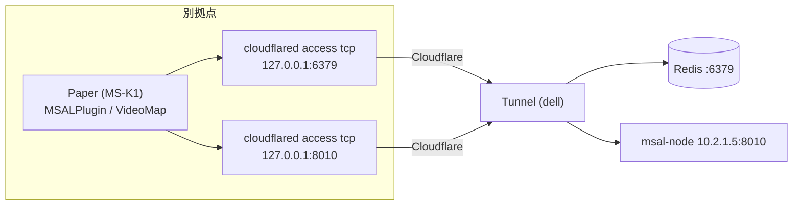

## 概要

別拠点の Paper サーバー（例: MS-K1）は、Redis（TCP）と msal-node（HTTP）に LAN で届かない。
どちらも **`cloudflared access tcp`** で中継して、MS-K1 から見て `127.0.0.1` に見えるようにする。
プラグインも VideoMap も**設定値を変えるだけ**で、コードの変更は要らない。



TCP のまま通るので、VideoMap の音声 push（長時間の HTTP POST）も、HTTP 経由で起きるボディ上限・バッファリングの問題なしで通る。

## 1. Cloudflare 側

**Tunnel（ProxmoxTunnel1）に公開ホスト名を 2 つ追加**（サービスの種類は **TCP**）

| ホスト名（例） | サービス |
| :--- | :--- |
| `msal-redis.clusters-prj.com` | `tcp://<Redis のアドレス>:6379` |
| `msal-api.clusters-prj.com` | `tcp://10.2.1.5:8010` |

**Access アプリを 2 つ作り、サービストークンだけ許可する**
1. Zero Trust → Access → サービス認証 → サービストークンを作成（例: `ms-k1`）。**シークレットはその場で控える**（再表示されない）
2. 上の 2 ホスト名それぞれに Self-hosted アプリを作成し、ポリシーのアクションを **Service Auth**、条件に上のトークンを指定
3. 人間（メール）の許可は入れない。TCP のホスト名はブラウザでは使えず、`cloudflared` クライアント専用

> Cloudflare 側の画面の表記は変わることがあるため、名称は目安。

## 2. MS-K1 側

`cloudflared` を入れ、2 本の中継を systemd で常駐させる。

`/etc/systemd/system/cloudflared-msal-redis.service`
```ini
[Unit]
Description=cloudflared access tcp (msal redis)
After=network-online.target
Wants=network-online.target

[Service]
EnvironmentFile=/etc/cloudflared-msal.env
ExecStart=/usr/local/bin/cloudflared access tcp --hostname msal-redis.clusters-prj.com --url 127.0.0.1:6379
Restart=always
RestartSec=5

[Install]
WantedBy=multi-user.target
```
`cloudflared-msal-api.service` は `--hostname msal-api.clusters-prj.com --url 127.0.0.1:8010` に変えるだけ。

`/etc/cloudflared-msal.env`（`chmod 600`）
```
TUNNEL_SERVICE_TOKEN_ID=<サービストークンの Client ID>
TUNNEL_SERVICE_TOKEN_SECRET=<サービストークンの Client Secret>
```

```bash
systemctl daemon-reload
systemctl enable --now cloudflared-msal-redis cloudflared-msal-api
redis-cli -h 127.0.0.1 -a '<パスワード>' ping     # PONG
curl -s http://127.0.0.1:8010/healthz               # {"ok":true}
```

> MS-K1 に Redis や msal-node が既に動いていて `127.0.0.1:6379` / `8010` が埋まっている場合は、`--url 127.0.0.1:16379` のようにポートをずらす。

## 3. プラグイン / VideoMap の設定

`plugins/MSALPlugin/config.yml`
```yaml
redis:
  host: 127.0.0.1
  port: 6379              # 中継のポートに合わせる
  password: "<Redis のパスワード>"
  database: 0             # msal-node の REDIS_URL と同じ番号
  timeout-ms: 1500        # トンネル越しなので少し長め
backend:
  base-url: "http://127.0.0.1:8010"
  login-url: "https://vc.clusters-prj.com/login/"   # プレイヤーのブラウザが開く公開 URL（変更なし）
  api-key: "<PLUGIN_API_KEY>"
```
`plugins/VideoMap/config.yml` の `vc-audio.base-url` も `http://127.0.0.1:8010`。

## 運用上の注意

- **Redis のパスワードは必須**。トンネル経由でも、中継を通れる人は Redis に何でもできる。サービストークンは MS-K1 専用にして、漏れたら失効させる。
- **遅延**: 座標は 250ms ごとに送る。往復が数十 ms なら問題ない。プラグインは、前回の送信が終わっていなければ**新しい送信を積まずにスキップ**する（古い座標を溜めない）。スキップが続く場合はコンソールに警告が出る。
- **断線**: 中継が切れても、座標は TTL 5 秒で消えるだけでサーバーには影響しない。`cloudflared` が復帰すると次の送信から自動で戻る。木曜早朝のルーター再起動もこの扱い。
- **`cloudflared` の監視**: `Restart=always` で復帰するが、`journalctl -u cloudflared-msal-redis` で接続エラーを確認できる。
- ワールド名の衝突: VC を使う Paper が複数あり、同じワールド名（`world` など）を使っていると、別サーバーの人同士が近接扱いになる。VC を使うサーバーが MS-K1 だけならそのままでよい。
